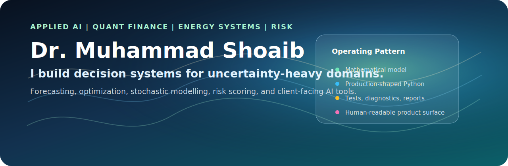
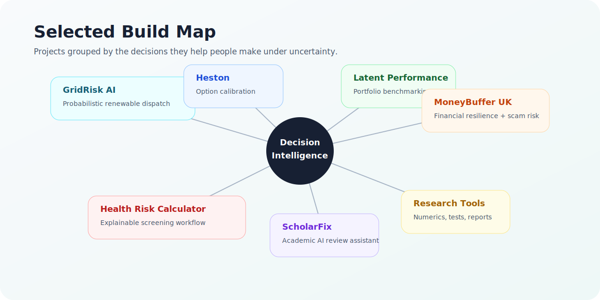

  

  
  
  

## What I Build

I build **decision-support systems for uncertainty-heavy domains**: energy dispatch, quantitative
finance, portfolio benchmarking, financial resilience, health risk, and academic AI tooling.

My work usually starts with a mathematical model and ends as something usable: a tested Python
package, a Streamlit or FastAPI interface, diagnostics, visual reports, and a README that explains
the trade-offs without hiding the assumptions.

| Signal | What it means in practice |
| --- | --- |
| Mathematical modelling | Stochastic volatility, frontier models, risk scoring, conformal intervals, CVaR optimization |
| Production-shaped Python | Typed modules, config, tests, CI, reproducible scripts, deployable app surfaces |
| Client-facing communication | Dashboards, PDF reports, explainable outputs, limitations, and decision context |
| Model risk awareness | Clear separation between diagnostics, forecasts, assumptions, and claims |

  

## Featured Projects

<table>
  <tr>
    <td width="50%" valign="top">
      <h3>GridRisk AI</h3>
      
Probabilistic renewable forecasting, conformal calibration, risk-aware dispatch, Streamlit dashboards, and FastAPI endpoints.

      

        
        
        
      

      
<a href="https://github.com/drmshoaib/probabilistic-renewable-dispatch"><strong>Open repository →</strong></a>

    </td>
    <td width="50%" valign="top">
      <h3>Heston Model Calibration</h3>
      
Fourier option pricing, nonlinear least-squares calibration, multi-start robustness, implied-vol diagnostics, and surface plots.

      

        
        
        
      

      
<a href="https://github.com/drmshoaib/heston-model-calibration"><strong>Open repository →</strong></a>

    </td>
  </tr>
  <tr>
    <td width="50%" valign="top">
      <h3>Latent Performance Benchmarking</h3>
      
Stochastic frontier decomposition for portfolio monitoring, factor-adjusted shortfall, rolling persistence, and mobility diagnostics.

      

        
        
        
      

      
<a href="https://github.com/drmshoaib/latent-performance-benchmarking"><strong>Open repository →</strong></a>

    </td>
    <td width="50%" valign="top">
      <h3>MoneyBuffer UK</h3>
      
Public-interest fintech tool for financial resilience, bill-shock simulation, scam-risk education, and explainable action planning.

      

        
        
        
      

      
<a href="https://github.com/drmshoaib/moneybuffer-uk"><strong>Open repository →</strong></a>

    </td>
  </tr>
  <tr>
    <td width="50%" valign="top">
      <h3>ScholarFix</h3>
      
Academic manuscript review assistant with citation and math checks, AI rewrite support, highlighted diffs, and PDF export packs.

      

        
        
        
      

      
<a href="https://github.com/drmshoaib/ScholarFix"><strong>Open repository →</strong></a>

    </td>
    <td width="50%" valign="top">
      <h3>Health Risk Calculator</h3>
      
Explainable health-risk screening workflow with structured package design, risk interpretation, PDF reports, and tests.

      

        
        
        
      

      
<a href="https://github.com/drmshoaib/health-risk-calculator"><strong>Open repository →</strong></a>

    </td>
  </tr>
</table>

## Build Stack

| Layer | Tools |
| --- | --- |
| Modelling and numerics | Python, NumPy, pandas, SciPy, scikit-learn, statsmodels |
| Optimization and risk | CVXPY, stochastic scenarios, CVaR, calibration, sensitivity analysis |
| Apps and APIs | Streamlit, FastAPI, Plotly, Matplotlib, Seaborn |
| Engineering quality | pytest, Ruff, GitHub Actions, config-driven pipelines, reproducible reports |
| Communication | Markdown, LaTeX tables, PDF exports, charts, model cards, technical summaries |

## Operating Style

I like projects that have a real decision behind them:

- Which dispatch plan is cheapest for the risk we are willing to carry?
- Which volatility parameters fit the surface, and which are weakly identified?
- Which portfolios show persistent factor-adjusted shortfall?
- Which households are exposed to a shock or a scam-risk pattern?
- Which manuscript changes are helpful, auditable, and safe for an author to accept?

The common thread is **uncertainty made usable**.

## Current Direction

I am especially interested in:

- Forecast-driven optimization for energy and operations.
- Quantitative finance tooling with strong diagnostics and clear model-risk boundaries.
- Applied AI products that produce useful reports, not just chat responses.
- Explainable risk tools for public-interest and client-facing decision support.

## Contact

For consulting, collaboration, or applied AI and quantitative modelling work:

**Email:** [safridi@gmail.com](mailto:safridi@gmail.com) 
**GitHub:** [github.com/drmshoaib](https://github.com/drmshoaib)
