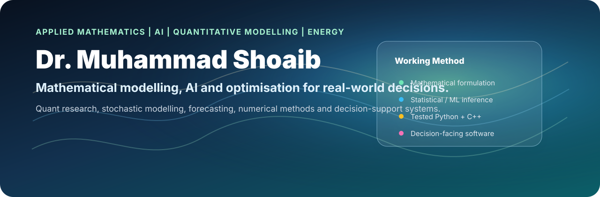
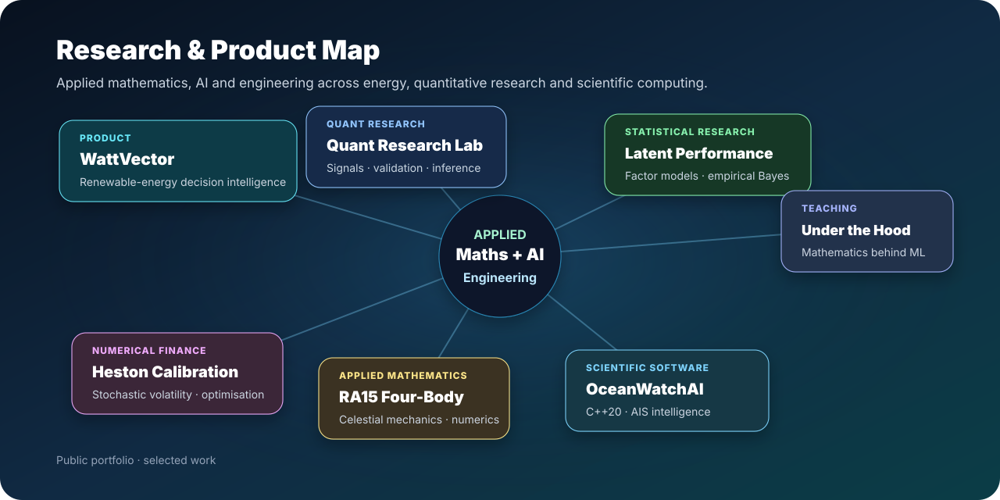

  

  
  
  

**Applied mathematician and data scientist working on quantitative modelling, machine learning, optimisation, energy analytics and uncertainty-aware decision systems.**

My work usually starts with a mathematical or statistical model and ends with something that can be tested and used: reproducible research, production-shaped Python or C++, model diagnostics, uncertainty analysis, APIs, dashboards and decision-support tools.

| Area | Methods and evidence |
| --- | --- |
| Applied mathematics | Numerical methods, optimisation, stochastic models, statistical inference, celestial mechanics |
| AI and data science | Probabilistic forecasting, gradient boosting, conformal calibration, risk scoring, explainable analytics |
| Quantitative research | Leakage-safe validation, HAC/Newey-West inference, factor models, empirical Bayes, bootstrap uncertainty |
| Engineering | Python, C++20, FastAPI, Streamlit, React, SQL, testing, CI and reproducible workflows |

  

## Featured Work

<table>
  <tr>
    <td width="50%" valign="top">
      <h3>WattVector — Renewable Energy Decision Intelligence</h3>
      
<strong>Probabilistic forecasting and risk-aware dispatch for renewable-energy operations.</strong>

      
WattVector turns uncertain renewable-generation forecasts into operational decisions. It combines quantile forecasting, calibrated uncertainty, scenario analysis and risk-aware optimisation so users can compare dispatch strategies, expected cost and downside exposure through an interactive decision-support application.

      
The public product provides a direct workflow from forecast uncertainty to operational comparison and dispatch analysis.

      

        
        
        
      

      
<a href="https://wattvector.streamlit.app/"><strong>Launch WattVector</strong></a>

    </td>
    <td width="50%" valign="top">
      <h3>Quant Research Lab</h3>
      
<strong>Reproducible cross-sectional quantitative research with a sealed hold-out.</strong>

      
An ETF ranking programme built around next-open execution, purged expanding-window validation, HAC/Newey-West inference, placebo testing, multiple-testing control, transaction costs and explicit robustness checks.

      
Current frozen development result: mean 5-session rank IC <strong>0.02701</strong>, HAC <strong>t = 3.922</strong>, <strong>p = 8.78e-5</strong>; positive mean IC in 12 of 13 eligible development years. The final 252-date hold-out remains locked.

      

        
        
        
      

      
<a href="https://github.com/drmshoaib/quant-research-lab"><strong>Open repository</strong></a>

    </td>
  </tr>
  <tr>
    <td width="50%" valign="top">
      <h3>Latent Performance Benchmarking</h3>
      
Factor-adjusted portfolio benchmarking with full cross-portfolio HAC inference, empirical-Bayes shrinkage, bootstrap rank uncertainty and forward validation.

      
The primary joint HAC/Wald test rejects zero alpha across the 25 portfolios with <strong>p = 6.42e-10</strong>. Across 89 forward windows, Fisher-averaged rank correlation is <strong>0.102</strong> with HAC 95% CI 0.055–0.149.

      

        
        
        
      

      
<a href="https://github.com/drmshoaib/latent-performance-benchmarking"><strong>Open repository</strong></a>

    </td>
    <td width="50%" valign="top">
      <h3>Heston Model Calibration</h3>
      
Stochastic-volatility calibration using the Heston model, Lewis Fourier pricing, implied-volatility inversion, bounded numerical optimisation, multi-start checks and surface-level diagnostics.

      
The repository is structured as a reproducible quantitative-finance project with tests, numerical convergence checks, diagnostic plots and an accompanying technical note.

      

        
        
        
      

      
<a href="https://github.com/drmshoaib/heston-model-calibration"><strong>Open repository</strong></a>

    </td>
  </tr>
  <tr>
    <td width="50%" valign="top">
      <h3>OceanWatchAI</h3>
      
Maritime intelligence MVP for explainable AIS trajectory analysis and suspicious-behaviour triage. The core engine is written in <strong>C++20</strong>, with a FastAPI backend, React/TypeScript analyst interface, SQL persistence, geospatial outputs and Docker-based deployment tooling.

      

        
        
        
      

      
<a href="https://github.com/drmshoaib/OceanWatch"><strong>Open repository</strong></a>

    </td>
    <td width="50%" valign="top">
      <h3>What's Under the Hood?</h3>
      
<strong>LinkedIn lecture series on the mathematics behind machine learning.</strong>

      
Each lecture starts from a familiar machine-learning API and works down to the objective function, geometry, optimisation, numerical linear algebra and implementation choices underneath it. The emphasis is on derivation, worked examples, failure modes and reproducible Python.

      

        
        
        
      

      

        <a href="https://drmshoaib.github.io/whats-under-the-hood/"><strong>Read the lecture series</strong></a>
        &nbsp;·&nbsp;
        <a href="https://github.com/drmshoaib/whats-under-the-hood"><strong>Repository</strong></a>
      

    </td>
  </tr>
</table>

## Applied Mathematics and Numerical Methods

My earlier and continuing work includes celestial mechanics and high-order numerical integration. The public **RA15 Four-Body** repository modernises a four-body numerical integration codebase around the RA15 method and provides a direct link between my applied-mathematics background and current computational work.

**Repository:** [RA15 Four-Body — modern version](https://github.com/drmshoaib/ra15-fourbody-modern_version)

## Technical Stack

**Modelling:** Python · NumPy · pandas · SciPy · statsmodels · scikit-learn · stochastic models · time series · optimisation · statistical inference

**Engineering:** C++20 · SQL · FastAPI · Streamlit · React/TypeScript · Docker · pytest · Catch2 · GitHub Actions · reproducible configuration

**Research practice:** purged walk-forward validation · HAC/Newey-West covariance · bootstrap inference · multiple-testing control · conformal calibration · scenario analysis · CVaR · model diagnostics

**Communication:** technical reports · LaTeX · mathematical derivations · dashboards · teaching material · client-facing decision tools

## Current Direction

I am particularly interested in work where mathematical modelling, AI and engineering meet a real decision: renewable-energy operations, quantitative research, risk-aware optimisation, numerical modelling and explainable analytical systems.

## Contact

For research, collaboration, consulting or senior applied-AI / quantitative modelling work:

**Email:** [safridi@gmail.com](mailto:safridi@gmail.com)  
**GitHub:** [github.com/drmshoaib](https://github.com/drmshoaib)
